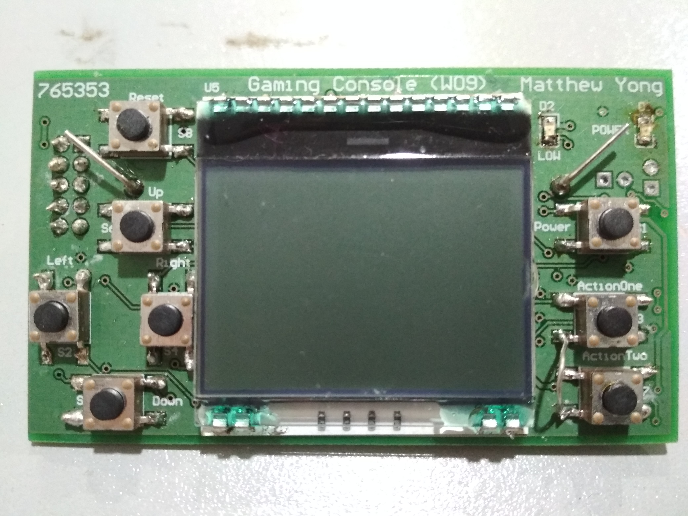
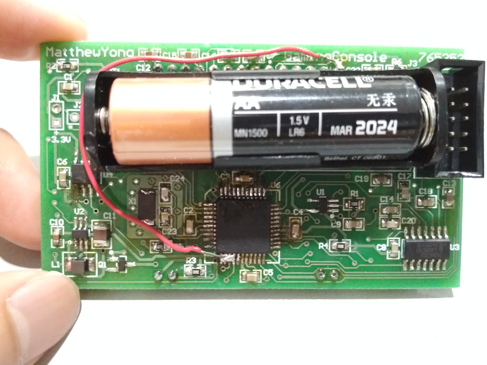

# Gane Console Project

A game console project on a self made embedded system.
Designed in Altium Designer
Programmed in AVR Studio and C

This was done on an 8 bit AVR microcontroller ATMEGA16 chip.
referred from documentation: https://www.gme.cz/data/attachments/dsh.958-112.1.pdf

# Menu Scroll Through
Buttons navigating through game console. Timer implemented on welcome screen.

# Brightness PWM:
Controlled using fast PWM Mode on ATMEGA16 chip

# Games:

## Flappy Bird
Simple Version with obstacles only from the bottom

## Pong
Simple Pong Game with two programmed AI.

## Guess
1. Three Options are given, one will be right.
2. If right answer selected, you move on.
3. If wrong answer selected, you go into Monty Hall Mode
-Two Options Left, one wrong answer is removed.
-Timer to choose right answer.

## Etch A Sketch
A Digital implementation of the traditional etch a sketch game

# Front View:

# Back View:

